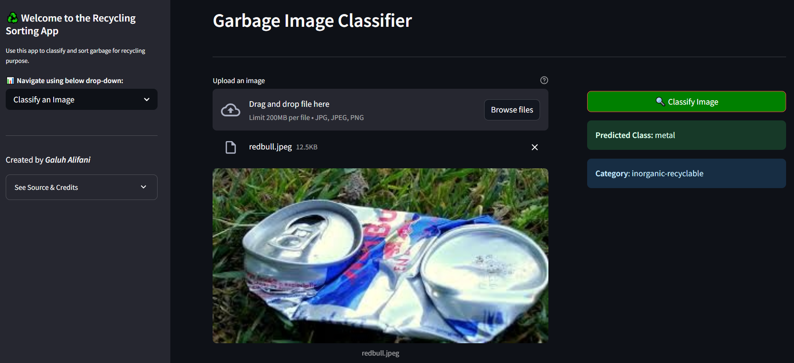

# [Recycling Classification CNN](https://huggingface.co/spaces/galuhalifani/recycling_classification)

## Problem Background
In Indonesia, waste is often thrown away without being sorted — all recyclables are combined together, and plastic, food scraps, paper, and even hazardous items all end up in the same bin. This lack of proper waste separation, especially at the household and small business level, makes it nearly impossible to recycle effectively. As a result, recyclable materials end up in the ocean instead of being recycled, organic waste ends up in landfills, and hazardous materials were not properly handled, posing dangers to the environment. This accelerates pollution in cities, rivers, and oceans.

## Project Output
This project will build an image classifier using an Artificial Neural Network (ANN) with CNN layers, to recognize the type of recyclable materials (e.g., plastic, glass, metal) from photos. The goal is to assist users and machines in identifying the correct category to dispose recyclables.

This model can be used by individuals, businesses, or as base model for garbage sorting machines to sort recyclable garbages.

The [Web App](https://huggingface.co/spaces/galuhalifani/recycling_classification) consist of two main pages:
- Data Insights: Contains exploratory data analysis of the dataset, including images and their respective classes
- Classify: Page to upload your image and test out the model to classify the garbage image.

## Data
*Data Source: [Garbage Classification, Kaggle](https://www.kaggle.com/datasets/asdasdasasdas/garbage-classification)*

**Dataset Description**

> The Garbage Classification Dataset contains 2.5k images from 6 garbage categories: cardboard (393), glass (491), metal (400), paper(584), plastic (472) and trash(127). The pictures were taken by placing the object on a white posterboard and using sunlight and/or room lighting.

The original dataset were obtained by Yang, Mindy and Thung, Gary for their [Stanford paper](https://cs229.stanford.edu/proj2016/report/ThungYang-ClassificationOfTrashForRecyclabilityStatus-report.pdf)

## Method
The method used in this project is CNN Computer Vision using Tensorflow, using model-training from scratch and pre-trained MobileNetV2

## Stacks
Tech stacks include:
- tensorflow keras
- python
- pandas & numpy
- streamlit for web-app UI
- scipy
- scikit-learn
- matplotlib & seaborn for visualization. 

The deployed web-app is utilizing HuggingFace as deployment platform

## Reference
- [Deployed Web App](https://huggingface.co/spaces/galuhalifani/recycling_classification)
- [Data Source](https://www.kaggle.com/datasets/asdasdasasdas/garbage-classification)

## Contact
Galuh Adika Alifani
galuh.adika@gmail.com

## Others
### Web App Snapshots

---